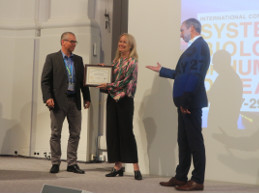

### In recognition of her work of creating the Cell Atlas using large-scale immunofluorescence, Emma receives the Anne Heidenthal Prize at the International Conference on Systems Biology of Human Disease!

> Posted at 2019-05-27

