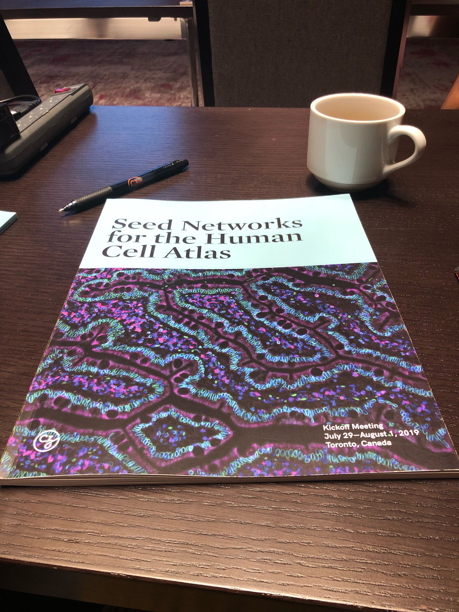

### Kicking off the [Chan-Zuckerberg Seed Grant initiative meeting] (https://medium.com/@cziscience/are-the-answers-to-disease-in-our-cells-f9a95f21efe), with the beautiful image of Duodenum by Anna Bäckström decorating the booklet. We are excited to realize Deep Visual Proteomics together with the teams of Matthias Mann and Peter Horvath!

> Posted at 2019-07-30

