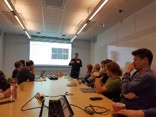

### 2-year seminar by Casper Winsnes, great work!

Casper: *The aim of my research is to create computational image analysis tools for the investigation of human protein distribution patterns in fluorescence microscopy images, with a particular focus on creating tools capable of handling the large percentage (51%) of proteins that localize to multiple cellular compartments. Then, using the developed tools as a base, create an informed model of the human cell to investigate how proteins interact with and affect each other.*

> Posted at 2019-10-24

