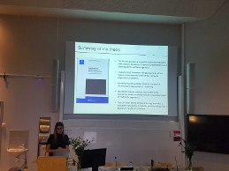

### PhD Defense by Diana, impressive work! Congratulations Dr. Mahdessian!

Thesis title: *Spatiotemporal characterization of the human proteome*

Abstract: *Characterizing the molecular components of the basic unit of life; the cell, is crucial for a
complete understanding of human biology. The cell is divided into compartments to create a
suitable environment for the resident proteins to fulfill their functions. Therefore, spatial
mapping of the human proteome is essential to understand protein function in health and
disease.*

> Posted at 2019-10-25

