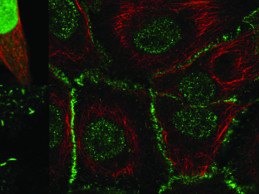

### Behind the HPA Image Classification Competition

An interesting [analysis] (https://protocolsmethods.springernature.com/users/333567-anthony-cesnik/posts/56923-behind-the-hpa-image-classification-competition) by Anthony about what is on the other side of the HPA challenge (held on the Kaggle Competition platform).

*We also believe that the winning models can be used for transfer learning, and our unique HPA Cell Atlas dataset can be used as a benchmark dataset for developing new models.* 

> Posted at 2019-12-03

