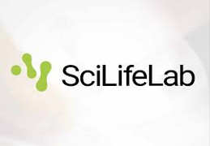

### SciLifeLab news: AI solutions crowd-sourced for the Human Protein Atlas !

Learn a bit more about [*the Human Protein Atlas (HPA) Image Classification competition*] (https://www.scilifelab.se/news/ai-solutions-crowd-sourced-for-the-human-protein-atlas/).

*We have been putting a lot of effort in the challenge design and result analysis afterwards. It shows a different way of engaging talented people from completely different fields. The combination of a big dataset and AI algorithms makes it possible to perform complex tasks with little or no domain knowledge. While the produced models are useful for the community, we also hope our unique image dataset can be used by more people as a benchmark image dataset for developing new algorithms* says Emma Lundberg.

> Posted at 2019-12-05
