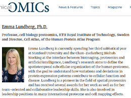

### Chatlotte in Teach Me in 10! 

Charlotte is interviewed by Teach Me in 10 where she *discusses the recent progress in antibody-based imaging, and how novel methods in this space are helping to facilitate advancements in proteomics research.*

Watch the whole interwview article [here] (https://www.clinicalomics.com/topics/translational-research/the-clinical-omics-10-under-40/).

> Posted at 2020-04-14

