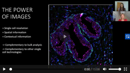

### Teach Me in 10 - Antibody-based Imaging with Dr. Charlotte Stadler 

Congratulations to the group for the two approved proposals!

Building a platform with AI models, datasets and web applications for fighting COVID-19
[Emma Lundberg, KTH] (https://www.scilifelab.se/scilifelab-efforts-during-the-covid-19-pandemic/the-scilifelab-national-covid-19-research-program/data-driven-research-models-and-ai/)

Spatial single cell mapping of SARS-CoV-2 interacting host proteins for quick and targeted drug repurposing
[Charlotte Stadler, KTH] (https://www.scilifelab.se/scilifelab-efforts-during-the-covid-19-pandemic/the-scilifelab-national-covid-19-research-program/drug-discovery-and-repurposing-of-drugs/)

*In March 2020, SciLifeLab launched a national call for researchers nationwide, to create a comprehensive program to combat the coronavirus pandemic. A total of 285 proposals were submitted, with applicants ranging from Swedish universities and hospitals, and other organizations both in Sweden and abroad. The SciLifeLab management group reviewed all proposals and approved 67 for funding. The funded  applications are grouped in 9 research areas. The projects will be funded with a total of 50 MSEK from Knut and Alice Wallenberg Foundation. Furthermore, the SciLifeLab board has allocated 12 MSEK to coordinating the program and connecting it with the SciLifeLab infrastructure, to further strengthen the effects of the initiative.*

> Posted at 2020-05-07

