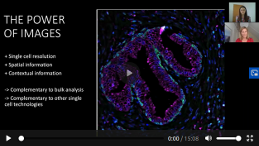

### Teach Me in 10 - Antibody-based Imaging with Dr. Charlotte Stadler 

Charlotte is interviewed by Teach Me in 10 where she *discusses the recent progress in antibody-based imaging, and how novel methods in this space are helping to facilitate advancements in proteomics research.*

Watch the whole interview article [here] (https://www.technologynetworks.com/tn/videos/antibody-based-imaging-with-dr-charlotte-stadler-336005).

> Posted at 2020-06-11

