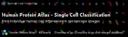

### New Kaggle challenge [“Human Protein Atlas - Single Cell Classification”] (https://www.kaggle.com/c/hpa-single-cell-image-classification/overview/description)!

It’s a fun challenge design with multi-label classification in a weakly supervised setting (we’re providing image-level labels and Kagglers are asked to segment cells and provide per-cell labels).
Please participate and also help us to spread the word. Top ranking teams will be invited to participate in comparing the models and writing an analysis article for Nature Methods!

> Posted at 2021-01-26

