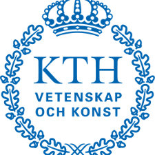

### Forskarna hoppas på skräddarsydda cancerläkemedel!

Check this [KTH article] (https://www.kth.se/cbh/nyheter/forskarna-hoppas-pa-skraddarsydda-cancerlakemedel-1.1052810) in Swedish about the amazing work done at the lab that has been published under the title *Spatiotemporal dissection of the cell cycle with single-cell proteogenomics*! 

> Posted at 2021-02-24

