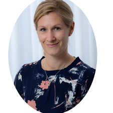

### Awesome news on Monday morning! 

Do you want to learn more about the highly multiplexed immunofluorescence technology named CODEX that Cell Profiling Facilities offers? Check this [interview] (https://www.akoyabio.com/blog/customer-spotlight-swedish-national-facility-enables-cutting-edge-spatial-proteomics/?utm_source=ActiveCampaign&utm_medium=email&utm_content=[Blog]+SciLifeLab+Enables+Cutting-Edge+Spatial+Proteomics%3A+Q+A+with+Dr++Charlotte+Stadler&utm_campaign=Blog+-+SciLifeLab)! 

> Posted at 2021-03-17

