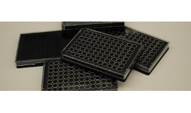

[**Immunofluorescence - production protocol**](./productionSOP.pdf)

Immunocytochemistry (ICC) is a technique for the visualization of proteins and peptides on cultured cells or cells with the extracellular matrix removed. using biomolecules capable of binding the protein of interest. Usually the biomolecule is an antibody that is linked to a reporter, e.g. a fluorophore, fluorescent dye, or enzyme. In the [Human Protein Atlas] (https://www.proteinatlas.org/learn/method/immunocytochemistry#specexample), ICC with fluorescence as a reporter is used to analyze the subcellular distribution of proteins to build a subcellular resolved cell atlas of the whole human proteome. For each protein the subcellular localization is studied in three different human cell lines, using the antibodies produced in the Human Protein Atlas project. The cells are cultured in vitro, fixed and permeabilized by formaldehyde and Triton X-100 detergent treatment, and then immunofluorescently stained. In addition to the Human Protein Atlas antibodies, two reference marker antibodies are used to stain the endoplasmic reticulum and microtubules fluorescently, and the cells are also counterstained with the nuclear probe DAPI. A confocal laser scanning microscope equipped with a 63x magnification, oil immersion objective is used to acquire high-resolution images of the staining. 

