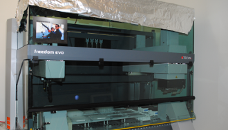

[**Tecan - liquid handling platform**]()

High-throughput profiling of protein targets are performed using a liquid handling plarform that allows optimized pipetting parameters for a broad range of liquid types and volumes, with fast liquid level detection, liquid availability check and preferential non-contact dispensing.

